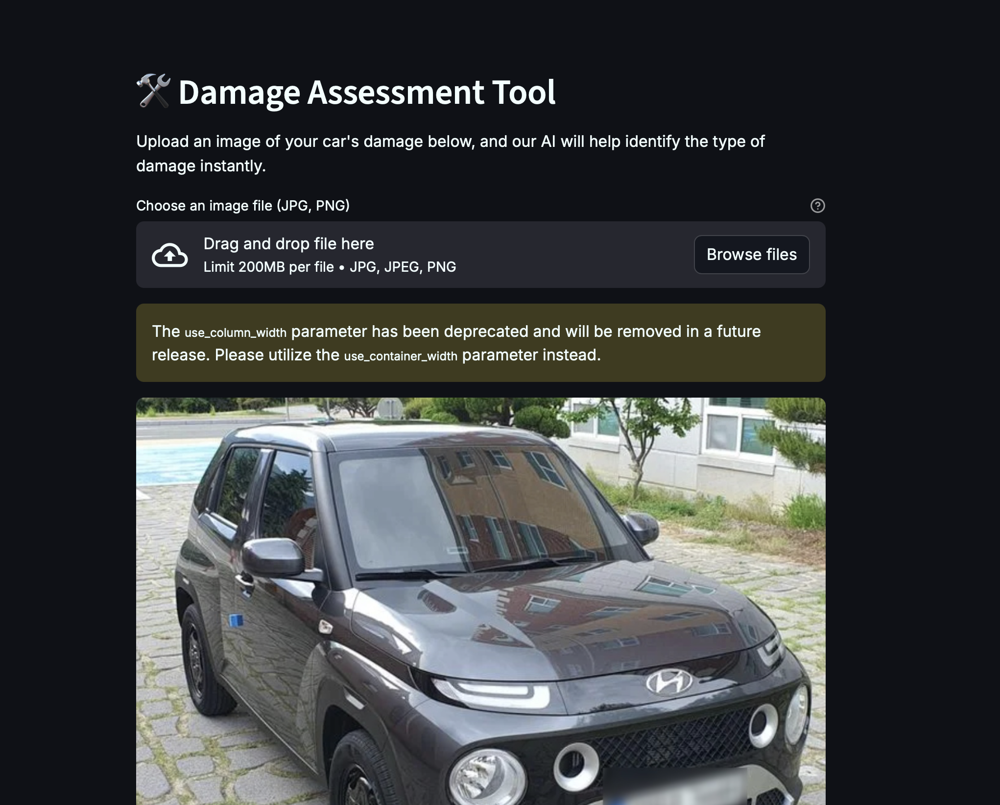

# Car Damage Detection and Severity Classification

## Project Overview

This project implements a deep learning model to detect car breakages and classify the severity of car damage. The system uses transfer learning with state-of-the-art architectures like EfficientNet and ResNet to achieve high accuracy in damage identification.



## Key Features

- **Damage Detection**: Identifies whether a car has damage or not
- **Severity Classification**: Classifies the damage into categories (e.g., minor, moderate, severe)
- **Transfer Learning**: Utilizes pre-trained models (EfficientNet, ResNet) for improved performance
- **Multi-class Classification**: Handles different types of car damage (front/back breakage, crushed, normal)

## Model Architecture

The project implements:

1. **EfficientNet** - Lightweight yet powerful CNN architecture
2. **ResNet** - Deep residual network for feature extraction
3. **Custom Classification Head** - Added on top of pre-trained models

## Dataset

The model was trained on a dataset containing:
- 2,300 images total
- 6 classes:
  - F_Breakage (Front Breakage)
  - F_Crushed (Front Crushed)
  - F_Normal (Front Normal)
  - R_Breakage (Rear Breakage)
  - R_Crushed (Rear Crushed)
  - R_Normal (Rear Normal)

Dataset split:
- 75% training (1,725 images)
- 25% validation (575 images)

## Training Details

- **Image Transformations**:
  - Random horizontal flip
  - Random rotation (10 degrees)
  - Color jitter (brightness=0.2, contrast=0.2)
  - Resize to 224×224
  - Normalization (mean=[0.485, 0.456, 0.406], std=[0.229, 0.224, 0.225])

- **Training Parameters**:
  - Batch size: 32
  - Optimizer: Adam or SGD (configurable)
  - Learning rate: Adjustable
  - Loss function: CrossEntropyLoss

## Requirements

To run this project, you'll need:

- Python 3.6+
- PyTorch
- Torchvision
- Matplotlib
- Other standard Python libraries (os, time, etc.)

## Installation

1. Clone the repository:
   ```bash
   git clone https://github.com/yourusername/car-damage-detection.git
   cd car-damage-detection
   ```

2. Install dependencies:
   ```bash
   pip install -r requirements.txt
   ```

## Usage

1. Prepare your dataset in the following structure:
   ```
   dataset/
   ├── F_Breakage/
   ├── F_Crushed/
   ├── F_Normal/
   ├── R_Breakage/
   ├── R_Crushed/
   └── R_Normal/
   ```

2. Run the training script:
   ```python
   python train.py --model efficientnet --epochs 50 --batch_size 32
   ```

3. For inference on new images:
   ```python
   python predict.py --image_path path_to_image.jpg --model_path saved_model.pth
   ```

## Results

The model achieves:
- High accuracy in damage detection (>90%)
- Good performance in severity classification
- Robust performance across different damage types

## Future Improvements

- Implement real-time damage detection
- Add localization to identify damage areas
- Expand dataset with more varied examples
- Optimize for mobile deployment

## License

This project is licensed under the MIT License.

## Acknowledgments

- PyTorch team for the deep learning framework
- Original authors of EfficientNet and ResNet
- Dataset contributors

For any questions or contributions, please open an issue or submit a pull request.
